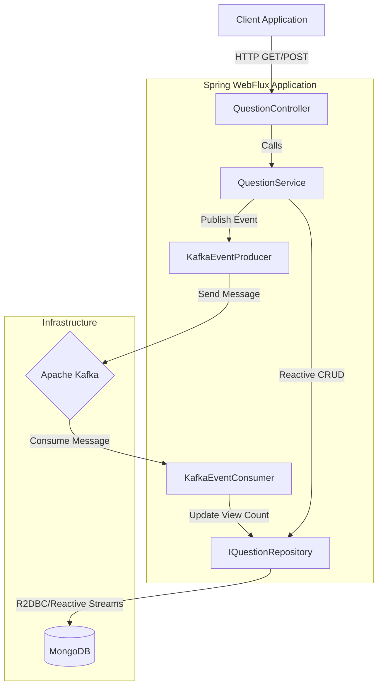
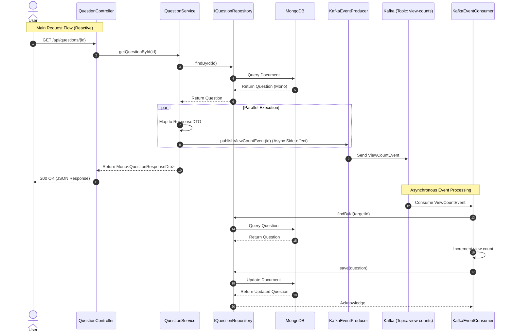

# Programmatic Flow Diagrams

## 1. High-Level Component Architecture

This diagram illustrates how the different components of the **Reactive Universal Question Answer Platform** interact with each other, the database, and the message broker.

## 2. Sequence Diagram: Get Question & Async View Count

This sequence diagram details the flow when a user fetches a question. It highlights the **non-blocking** nature of the main request and the **asynchronous** handling of the view count increment via Kafka.

## 3. Key Data Flows

### A. Question Creation (Write)
1.  **Client** sends `POST /api/questions` with JSON payload.
2.  **Controller** delegates to `QuestionService.createQuestion`.
3.  **Service** converts DTO to Entity and sets timestamps.
4.  **Repository** saves to **MongoDB**.
5.  **Service** returns the created object to **Client**.

### B. Infinite Scroll (Read)
1.  **Client** sends `GET /api/questions?cursor={timestamp}`.
2.  **Controller** calls `QuestionService.getAllQuestions`.
3.  **Service** validates cursor.
    *   If valid: Queries MongoDB for records `createdAt > cursor`.
    *   If null: Queries top 10 records ordered by `createdAt`.
4.  **Repository** executes optimized range query.
5.  **Service** returns `Flux<QuestionResponseDto>` to **Client**.
